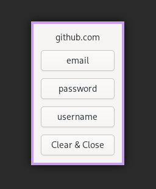

# passmumbler

A simple graphical tool which integrates with [password-store](https://www.passwordstore.org/)
and [rofi](https://github.com/davatorium/rofi) or [dmenu](https://tools.suckless.org/dmenu/)
to easily copy passwords (and other secrets) to the clipboard.



Why? Because I'm lazy and I don't want to type my passwords, but I also don't
want to deal with different plugins for different browsers or other
applications.

## Installation

Clone this repository and run `cargo install --path .` in the repository root.

## Usage

To use `passmumbler`, you need to have a password store initialized.
See the [password-store documentation](https://www.passwordstore.org/#usage)
for more information.

You also need to have either `rofi` or `dmenu` installed.

To select a password with the default interface (dmenu), run:

```shell
passmumbler select
```

To select a password with rofi, run:

```shell
passmumbler select -i rofi
```

To show only passwords with a certain prefix, run:

```shell
passmumbler select -p prefix
```

For instance, if you have all your favorite passwords under `favorites` folder
in your password store, and you want to select one of them with rofi, run:

```shell
passmumbler select -i rofi -p favorites/
```

To just show a dialog with a button to copy a password, run:

```shell
passmumbler show -p the_password -u the_username
```

This can be useful to integrate with other tools.